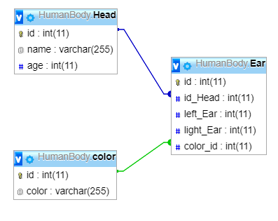
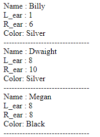
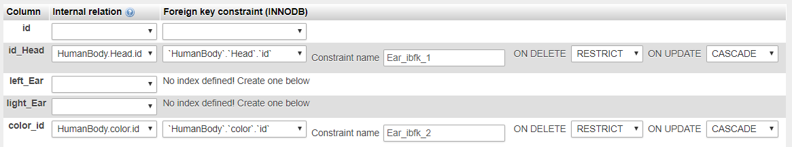

## Synopsis

Database created with PHPmyAdmin



#Database created with PHPmyAdmin
##Database preview


## Code Example
```
   $sql = "SELECT `Head`.`name`, `Ear`.`left_Ear`, `Ear`.`light_Ear`, `color`.`color`\n"
    . "FROM `Head`\n"
    . " INNER JOIN `HumanBody`.`Ear` ON `Head`.`id` = `Ear`.`id_Head` \n"
    . " INNER JOIN `HumanBody`.`color` ON `Ear`.`color_id` = `color`.`id` \n"
    . " LIMIT 0, 30 ";
```
And yes i know it should be Right ear.
## MySql

## Motivation

MySql & Sql query 
Display from Query

## PHPmyAdmin Fields
inner and foreign key constraint INNODB
