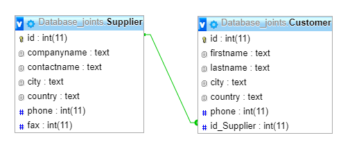
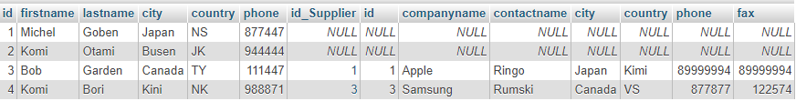
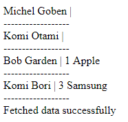

## MySql UNION
This is mySql union query

## Code
```
SELECT * 
FROM Customer
LEFT JOIN Supplier ON Customer.id_Supplier = Supplier.id
LIMIT 0 , 30
```
## Data tables


## Phpmyadmin

This still have repeating information at id -> 3.

## Output


